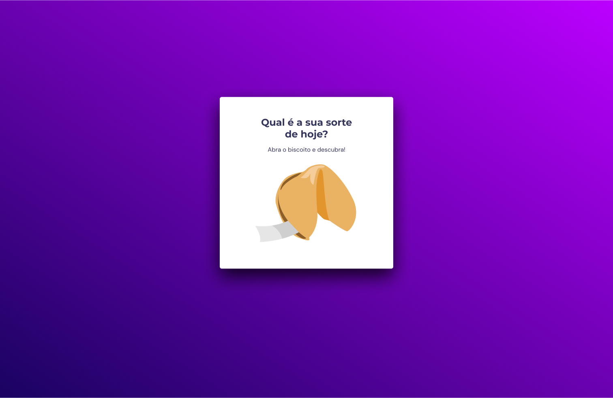
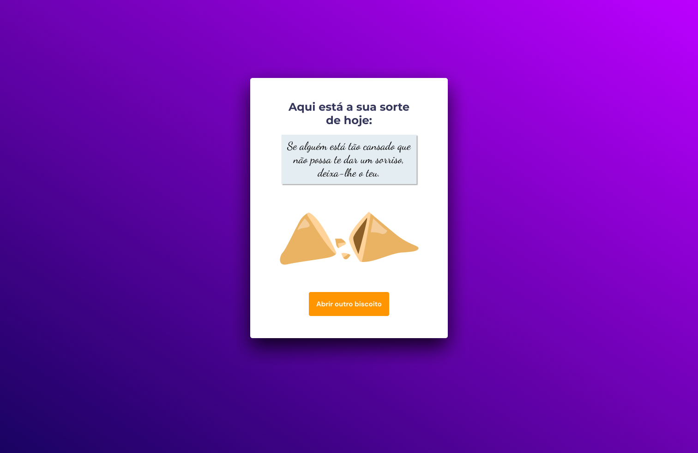

# Biscoito-da-Sorte
- Criação de um jogo chamado Biscoito da Sorte, no qual o usuário, a partir de um clique ou enter, abre um biscoito com a sua sorte do dia.  
- Desafio realizado a partir da plataforma [Rocketseat](https://www.rocketseat.com.br/)  

## Conhecimentos utilizados:     

- Estrutura de dados HTML
- Animações com CSS
- Funções no Javascript
- Manipulação da DOM
- Funções *callback*
- Arrays    
  
## Layout da aplicação

- [Figma](https://www.figma.com/file/gESPUCrLnIFDT2XrCejpc7/Biscoito-da-Sorte?node-id=0%3A1&t=txUSjWZjby9hgHpX-0)

